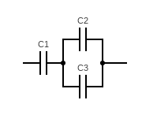

# Mid-term test 1 (variant 3)

The test consists of three tasks located in directories `app`, `physics` and
`ping-pong`. Fork the repository, add/edit files in the directories in order to
complete the test. The completed test must be submitted as a GitHub pull request
to `prog-1/test-1-3` repository.

1. Explain what the program in the directory `app` does. Add your explanations
   as comments in the source code. Feel free to add any comments that you think
   are necessary.

2. Write a program in the directory `physics`. The user provides three numbers:
   capacity of three capacitors `C1` `C2` and `C3` (assume `C1, C2, C3 > 0`).
   The program must calculate and print the total capacity `C` of the following
   circuit:

   

   `C` can be found using the following equation: `1/C = 1/C1 + 1/(C2 + C3)`.

   Example:

   ```
   The program finds the capacity of the three capacitors (see the circuit):
   Enter capacity of three capacitors: 1 2 3
   The total capacity of the three capacitors is 0.8333333333333334
   ```

3. Write a program in the directory `ping-pong` that prints the following for
a provided number:

    - `Ping` if the number is even;
    - `Pong` if the number is divisible by 7;
    - `PingPong` if the number is even and divisible by 7;
    - The number itself, otherwise.

    Example 1:

    ```
    The program prints Ping, Pong or a number.
    Enter a number: 4
    Ping
    ```

    Example 2:

    ```
    The program prints Ping, Pong or a number.
    Enter a number: 21
    Pong
    ```

    Example 3:

    ```
    The program prints Ping, Pong or a number.
    Enter a number: 70
    PingPong
    ```

    Example 4:

    ```
    The program prints Ping, Pong or a number.
    Enter a number: 5
    5
    ```
